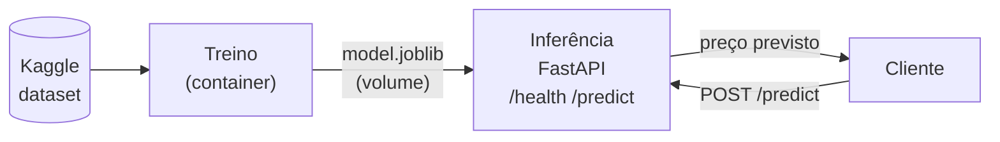

## Devlog Docker Preditor Ethereum

Primeiro, fui decidir qual dataset iria utilizar e escolhi um dataset do kaggle que contém dados históricos do preço do Ethereum (https://www.kaggle.com/datasets/varpit94/ethereum-data/data). O dataset contém as seguintes colunas: Date, Open, High, Low, Close, Volume, Market Cap.

Depois, decidi quais biliotecas de python iria utilizar para cada container. Então, decidi nessas:

### Container de treinamento
Global
- python 3.12
`docker/train`
- pandas
- scikit-learn
    - Modelo LinearRegression 
- joblib
`docker/inferencia`
- fastapi
- uvicorn

Dai criei um venv com uv, e pedi pra o meu Sonnet 5.5 para desenhar o diagrama conforme minha arquitetura, puxando os dados do Kaggle, treinando o modelo e disponibilizando a inferência via FastAPI. Segue o diagrama gerado por ele:

