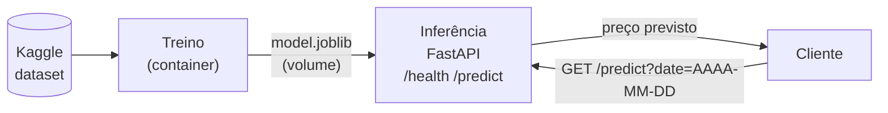

## Devlog Docker Preditor Ethereum

### 1. Dataset
Escolhi um dataset do Kaggle com o histórico de preço do Ethereum: https://www.kaggle.com/datasets/prasoonkottarathil/ethereum-historical-dataset. Uso o arquivo `ETH_day.csv` (preços diários de 2016-05-09 a 2020-04-15, com Date, Open, High, Low, Close, Volume ETH e Volume USD). Comecei com outro dataset (varpit94/ethereum-data) e troquei por este por ter arquivos diários, horários e por minuto.

### 2. Bibliotecas (Python 3.12)
`docker/train`
- kagglehub
- pandas
- numpy
- scikit-learn (Ridge, GradientBoosting, validação cruzada temporal)
- joblib

`docker/inferencia`
- fastapi, uvicorn
- pandas, numpy
- scikit-learn, joblib (mesmas versões do treino)

Depois de definir as bibliotecas que iria utilizar, criei um venv com uv e instalei tudo acima. Depois criei um requirements.txt global com todas as dependências para o teste local ficar mais fácil.

### 3. Arquitetura
Pedi ao Sonnet 5.5 para desenhar o diagrama da arquitetura:



O modelo chega ao container de inferência por um volume Docker: o treino salva em `docker/artefatos/` (volume `eth_artefatos`) e o mesmo volume é montado na inferência. Rodando em python e fora do docker o treino salva em `docker/artefatos/`.

### 4. Estrutura
- `docker/train/`: Dockerfile e train.py, que baixa o dataset, treina e salva o modelo.
- `docker/artefatos/`: model.joblib (modelo + tabela de features de cada dia) e metadata.json (métricas, só para consulta).
- `docker/inferencia/`: Dockerfile, main.py (FastAPI) e requirements.txt.
- `docker/requirements.txt`: dependências completas para rodar local.
- `docker-compose.yml`: define os dois containers e o volume compartilhado, para subir tudo com um comando.

#### 4.1 docker-compose.yml
O compose tem dois serviços, **treino** e **inferencia**, e o volume *`eth_artefatos`* montado nos dois. A **inferencia** só sobe depois que o **treino** termina com sucesso então o modelo já está no volume quando a API carrega. 

Usei `--no-cache-dir` no `pip install` para deixar as imagens menores.

### 5. Versões
**Primeira versão (LinearRegression):** previa o preço do dia seguinte a partir de Open, High, Low, Close e Volume. O MAE ficou em torno de 2.316, que é muito ruim 
**Segunda versão (Prophet):** usava só a data. Melhorou o MAE para cerca de 56, mas era só um ajuste de tendência, sem informação de mercado. Um baseline simples (repetir o preço do dia anterior) tinha MAE de 6,2, bem melhor.
**Terceira versão (sklearn):** passei a prever o retorno do dia seguinte, e converto de volta para preço. Features: os últimos 5 retornos diários e a razão do fechamento para as médias de 7 e 30 dias. Comparei LinearRegression, RandomForest e GradientBoosting por validação cruzada temporal no treino, sem usar o teste para escolher o modelo. O split treino/teste é cronológico (80/20, sem embaralhar) para não vazar o futuro.
**Quarta versão [FINAL] (sklearn)**: fiz uma pesquisa no GPT Luna 6.1 para fazer um brainstorm de como melhorar mais que a naive (que ele falou que com um modelo simples já é bem difícil). O que nós dois construímos foi:
- pred_close = close_today * exp(pred_return), o que significa que o modelo prevê o retorno (logarítmico), reduzindo o ruído que é só prever o preço.
- fazer o resultado predito ser bem perto de 0, simulando o naive só que possivelmente melhorado (com Ridge de regularização forte e GradientBoosting raso).
- features como:
    - quanto ETH foi movido em certos intervalos de tempo (1, 3, 7 e 14 dias)
    - desvio padrão de quanto ETH foi movido em um intervalo de tempo (7 e 30 dias)
    - quão longe o preço está da média de 30 dias em uma porcentagem

Então fiz um modelo com base nessas features e o resultado ficou praticamente igual ao da baseline: o GradientBoosting raso teve o menor MAE no teste (6,09 contra 6,11), mas a validação cruzada escolheu o Ridge (alpha=10000), que é o modelo salvo no joblib.

### 6. Resultados do treino
Erro médio absoluto (MAE, em USD) nos 20% finais dos dados:

- Baseline (Naive) 6,11
- Ridge (alpha=10) 6,13
- Ridge (alpha=100) 6,11
- Ridge (alpha=1000) 6,12
- Ridge (alpha=10000) 6,15 (escolhido pela validação cruzada)
- GradientBoosting (raso) 6,09

Só o GradientBoosting (raso) superou o baseline, mas não por muito. Pesquisei sobre isso e é o esperado em retornos diários de criptomoedas, que acabam sendo muito ruidosos.

### 7. Rotas

`GET /health`: retorna 200 OK se o servidor estiver no ar e funcionando
`GET /predict?date=AAAA-MM-DD`: procura dentro do joblib a data especificada e retorna o preço previsto para o dia seguinte. Só aceita datas de 2016-06-08 a 2020-04-15; fora disso retorna 404.

Como o modelo final é treinado com todos os dados, a previsão de uma data do dataset já foi vista no treino. A avaliação real do modelo é a da seção 6.

### 8. Como reproduzir
```bash
# treino: gera o modelo no volume (precisa de internet para baixar o dataset)
docker build -t eth-train docker/train
docker run --rm -v eth_artefatos:/artefatos eth-train

# inferência: monta o mesmo volume
docker build -t eth-infer docker/inferencia
docker run --rm -p 8000:8000 -v eth_artefatos:/artefatos eth-infer
```

### 9. Testes
Rodei tudo no Docker Desktop, pelo PowerShell e pelo WSL (Ubuntu). O treino no container gerou as mesmas métricas do treino local, e a inferência subiu carregando o modelo do volume.

```bash
curl http://localhost:8000/health
# {"status":"ok"}

curl "http://localhost:8000/predict?date=2020-04-01"
# {"date":"2020-04-01","last_close":136.0,"predicted_log_return":0.0019237742784885123,"prediction":136.26188512504046,"next_date":"2020-04-02","actual":141.56}

curl "http://localhost:8000/predict?date=2030-01-01"
# {"detail":"Data fora do histórico (2016-06-08 a 2020-04-15)"}   (HTTP 404)
```

Também dá para testar pelo navegador em http://localhost:8000/docs.

O resultado foi igual no PowerShell (`Invoke-RestMethod`) e no WSL (`curl`). Na previsão de 2020-04-01, o modelo previu 136,26 e o preço real do dia seguinte foi 141,56. Isso é o esperado: como as previsões ficam perto de zero, o resultado é quase o preço do dia anterior.

### 10. Conclusão

É muito dificil conseguir melhorar a baseline, mas conseguimos algo proximo porque deixamos a mudança bem perto de 0. O projeto foi um exemplo separado em dois containers, um de treino e outro de inferencia com dependencias diferentes mas com volumes compartilhados.