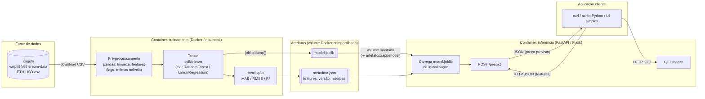
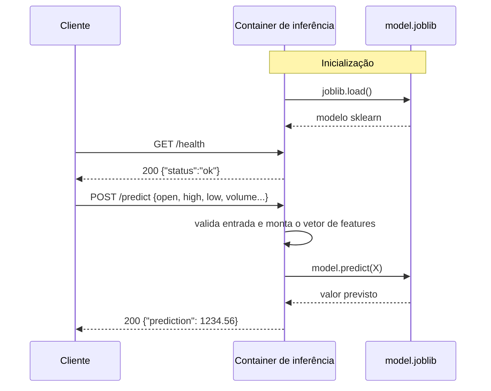

## Devlog Docker Preditor Ethereum

1. Desenhar a arquitetura: faça um esboço UML que represente os componentes da solução e a troca de dados entre eles. Inclua, no mínimo, o ambiente de treinamento, o artefato gerado pelo modelo, o container de inferência/backend e a aplicação cliente. Indique como o modelo treinado chega ao container de inferência.
2. Treinar e exportar o modelo: execute o treinamento em um container Docker ou notebook e salve o modelo em um formato que possa ser carregado posteriormente.
3. Preparar a inferência: implemente em Python o backend do container de inferência. Ele deve carregar o artefato treinado e disponibilizar uma operação para solicitar uma predição. Inclua também uma forma simples de verificar se o serviço está ativo.
4. Integrar e testar: execute os componentes necessários e demonstre que uma solicitação chega ao backend e retorna uma predição. Registre os comandos usados e os resultados observados.
5. Manter o devlog: documente, ao longo do desenvolvimento, as decisões, etapas realizadas, dificuldades, alterações e testes. Inclua o diagrama UML e evidências suficientes para outra pessoa compreender e reproduzir a solução.

Primeiro pedi pra o meu Sonnet 5.5 para desenhar o diagrama conforme minha arquitetura

https://www.kaggle.com/datasets/varpit94/ethereum-data/data 
